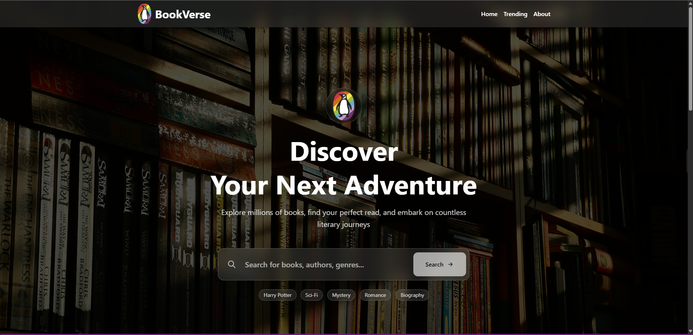
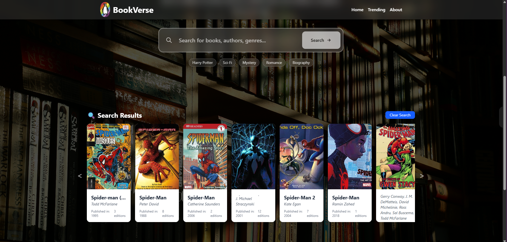
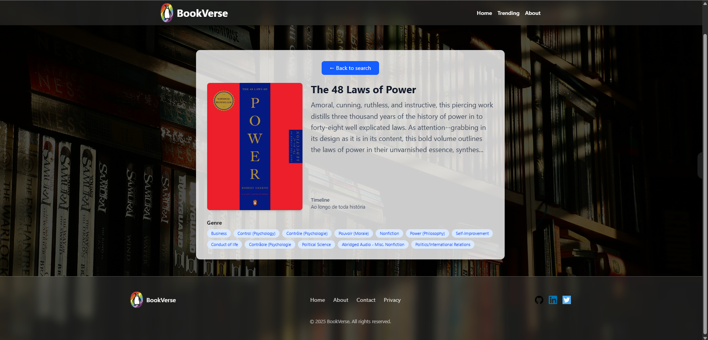
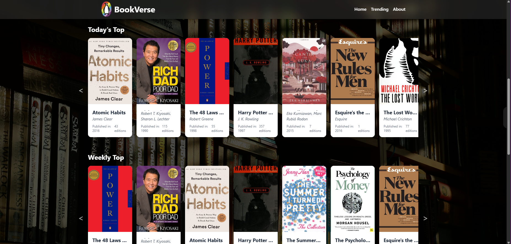

# BookVerse

A sleek and modern book discovery platform built with **React.js**. Explore millions of books, search by title, author, genre, and filter by publication year. Discover trending books daily, weekly, and monthly, with an intuitive and visually appealing UI.





## 🔗 Live Demo

> [BookVerse](https://bookversedot.netlify.app/)


## 🛠 Features

### 1. **Search & Discovery**

* Search books by **title**, **author**, or **genre**.
* Quick-access search suggestions: *Harry Potter, Sci-Fi, Mystery, Romance, Biography*.
* Shows **top search results** with detailed book information.

### 2. **Filters**

* Filter search results by **author**.
* Filter books by **publication year** (1950–2025).
* Easily combine search + filters for precise results.

### 3. **Trending Books**

* Daily, weekly, and monthly trending books sections.
* Horizontally scrollable lists with left/right arrows.
* Dynamic and visually appealing display with cover images.

### 4. **Book Details Page**

* Detailed book view with:

  * Title & Cover
  * Description
  * Genres & Subjects
  * Places, Timeline, Characters
  * Publication info & edition count
* Clean layout with centered main container.

### 5. **Modern UI/UX**

* **Glassy header and footer** with blur effects for a sleek look.
* Responsive design for mobile and desktop.
* Smooth scroll and hover animations for interactive feel.

### 6. **Components**

* `SearchBook` – Search bar with suggestions
* `BookList` – Display books in grid or horizontal scroll
* `BookCard` – Individual book card with cover and info
* `TrendingBooks` – Sectioned trending books
* `Book` – Detailed book page
* `Header` & `Footer` – Modern glassy navigation

### 7. **Hooks**

* `useBooks` – Handles fetching and state for searched books
* `useTrendingBooks` – Handles fetching trending books (daily, weekly, monthly)


## ⚡ Technologies Used

* **React.js** – Frontend framework
* **Tailwind CSS** – Modern and responsive styling
* **React Router** – Client-side routing
* **Open Library API** – Book data
* **Fetch API** – Data fetching


## 🖼 Screenshots

**Home Page**


**Search Results**


**Book Details**


**Trending Books**



## 🚀 Getting Started

### Prerequisites

* Node.js >= 14.x
* npm or yarn

### Installation

```bash
# Clone the repository
git clone https://github.com/yourusername/bookverse.git

# Navigate into project directory
cd bookverse

# Install dependencies
npm install
# or
yarn install
```

### Running Locally

```bash
npm start
# or
yarn start
```

Open [http://localhost:3000](http://localhost:3000) to view the app.


## Project Structure

```
bookverse/
├─ public/
├─ src/
│  ├─ Components/
│  │  ├─ Book.jsx
│  │  ├─ BookCard.jsx
│  │  ├─ BookList.jsx
│  │  ├─ SearchBook.jsx
│  │  ├─ TrendingBooks.jsx
│  │  ├─ Header.jsx
│  │  └─ Footer.jsx
│  ├─ hooks/
│  │  ├─ useBooks.jsx
│  │  └─ useTrendingBooks.jsx
│  ├─ App.jsx
│  └─ index.js
├─ package.json
└─ README.md
```


## Future Improvements

* Add **pagination** for search results.
* Add **mobile-friendly menu** with hamburger navigation.
* Integrate **user login** to save favorite books.
* Dark/light theme toggle.
* Implement **infinite scroll** for trending books.


## Design & UX

* Glassy header & footer with **blur effect** (`backdrop-blur-lg`).
* Horizontal scroll for trending books with **custom arrow buttons**.
* Hover effects and smooth transitions.
* Responsive typography and spacing.


## Credits

* Open Library API – [https://openlibrary.org/developers/api](https://openlibrary.org/developers/api)
* Unsplash – Background images
* Tailwind CSS – Styling framework
* Inspiration: Book discovery platforms & sleek UI designs


## License

MIT License © 2025 – *Shiv*
